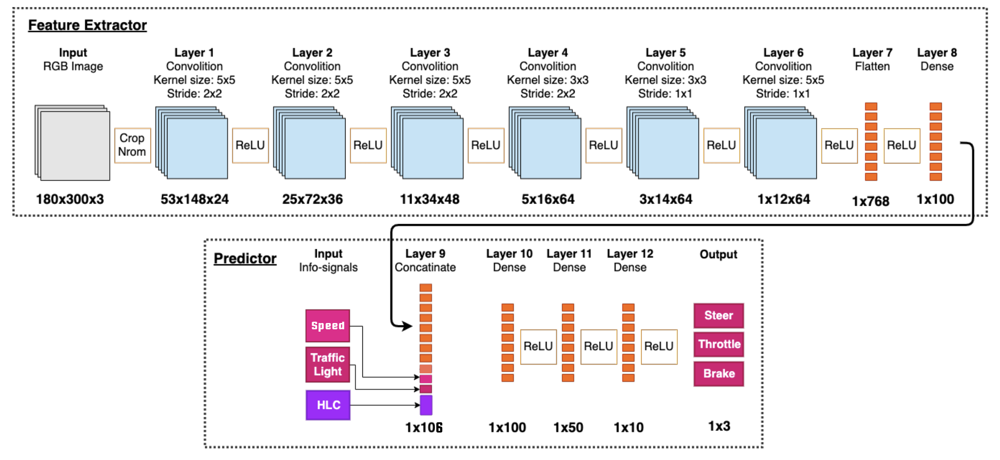

# Self driving with simulator
This respository was created for the senior project of our Bachelor's Degree in Computer Science.<br/>
This project is focusing on prediction the car behaviour using Conditional Imitation Learning.<br/>
For the network that we used in this project we modified from [Autonomous vehicle control: End-to-end Learning in Simulated Urban Environment](https://arxiv.org/pdf/1905.06712.pdf)<br/>

**Note:** All data in our dataset collected from simulator [CARLA](http://carla.org/)<br/>

## Getting Started
**CARLA Simulator**<br/>
- Please following the installation in: [CARLA Documentation](https://carla.readthedocs.io/en/latest/)<br/>

**Clone this repository**<br/>
```
git clone https://github.com/ploymel/imitation_learning.git
```

**Note:** For the other necsssary agents source code of this project please refer to: [carla agents API github](https://github.com/carla-simulator/carla/tree/master/PythonAPI/agents)<br/>

## Requirements
- tensorflow_gpu 1.1 or more
- Keras
- numpy
- scipy
- PIL
- Jupyter Notebook
- pygame
- category_encoders
- **Game Controller**

## Running
**Collect data**<br/>
Before running the program plug-in game controller (Game controller is for telling the command but you can modify the code to suit you if you didn't got one) <br/>
```
$ python data-collect.py -f [folder-destination]
```
After the program running press `R` to start Recording.<br/>
**TO CONTROL THE VEHICLE** <br/>
- Using WASD or the arrows to control the vehicle.
- Using X B and RT to give the command: X for Left B for Right and RT for straight
- Using A to terminate the episode and start new episode
- Using Y to change gear

**Training Model** <br/>
The training files are in `models/*/model.ipynb` folder
```
# open jupyter notebook
$ jupyter notebook
```

**Testing**
- Open the simulator
- Run the following command
```
$ python drive.py -a Imitaion -m [model-file.h5]
```

## Dataset
- [The dataset for the first pharse - no obstacles and traffic lights can be download here](https://drive.google.com/file/d/10JjikJQZ5JbDYhTSYndP4SWr8NyyITKQ/view?usp=sharing) 9.6 GB

The data is stored on CSV file. The CSV contains 8 columns:<br/>
1. frame (Frame number)
2. image path (The RGB images stored at 200x66 resolution)
3. throttle, float
4. steering_angle, float
5. brake, float
6. speed, float
7. traffic_state, int
7. high_level_command, float (which 1.0, 2.0, 3.0 and 4.0 are represented left, right, straight and lanefollow.)

## Preprocess
See [data_augmetation.ipynb](https://github.com/ploymel/imitation_learning/blob/master/augmentation/data_augmentation.ipynb) for more information.

## Neural Network



## References
- [Autonomous vehicle control: End-to-end Learning in Simulated Urban Environment](https://arxiv.org/pdf/1905.06712.pdf)<br/>
Hege Haavaldsen, Max Aasbø, Frank Lindseth
- [End-to-end Driving via Conditional Imitation Learning](http://vladlen.info/papers/conditional-imitation.pdf)<br/>
Codevilla, Felipe and Müller, Matthias and López, Antonio and Koltun, Vladlen and Dosovitskiy, Alexey. ICRA 2018
- [End to End Learning for Self-Driving Cars](https://images.nvidia.com/content/tegra/automotive/images/2016/solutions/pdf/end-to-end-dl-using-px.pdf)<br/>
Nvidia

